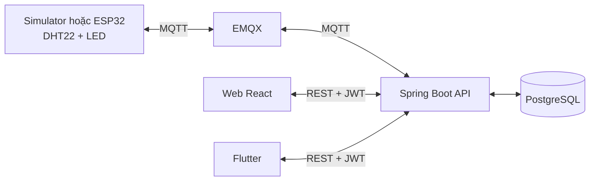
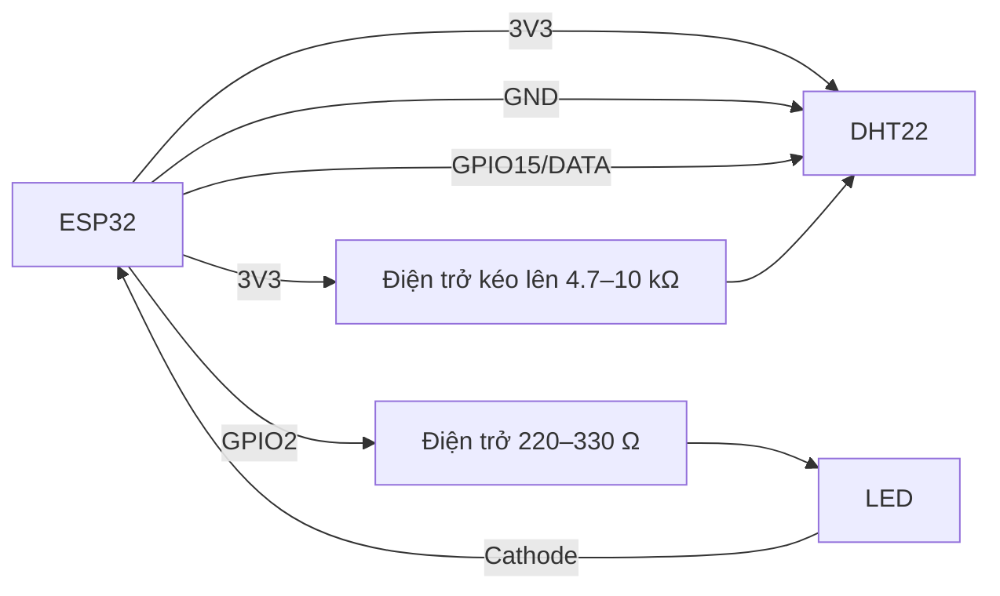

# EcoSense — IoT Smart Environment Monitoring and Control

> Chạy demo tuần 4 bằng `powershell.exe -ExecutionPolicy Bypass -File .\scripts\start-demo.ps1`. Xem [hướng dẫn demo, cắm DHT22 3 chân và LED](docs/demo-tuan-4.md).

Chạy toàn bộ với **ESP32 thật + web + Android Emulator**:

```powershell
powershell.exe -NoProfile -ExecutionPolicy Bypass -File .\scripts\run-all-real.ps1
```

Thêm `-FlashEsp32 -Port COM3` nếu cần build và nạp lại firmware. Dừng Docker và Android Emulator bằng `powershell.exe -NoProfile -ExecutionPolicy Bypass -File .\scripts\stop-all.ps1`.

Dự án triển khai từ [mã mẫu chương 5](https://github.com/nguyentrungkiet/demo_chuong_5_lt) theo tài liệu hướng dẫn của học phần. Hệ thống có simulator Python, firmware ESP32, EMQX, Spring Boot, PostgreSQL, web React và app Flutter. Cả simulator và ESP32 dùng `deviceId=esp32-001` và cùng một hợp đồng MQTT.

## Kiến trúc



## Chạy bằng simulator

Tại thư mục gốc dự án, cần Docker Desktop đang chạy:

```bash
docker compose up --build -d
docker compose ps
```

Mở `http://localhost:3000` để đăng nhập. Swagger ở `http://localhost:8080/swagger-ui/index.html`, EMQX Dashboard ở `http://localhost:18084` (`admin` / `public`). Máy này đã có một broker khác dùng cổng 1883/18083 và Windows không cho bind cổng 80, nên Compose mặc định xuất web qua 3000, broker qua 1884 và EMQX Dashboard qua 18084. Có thể đổi bằng `WEB_HOST_PORT`, `MQTT_HOST_PORT` và `EMQX_DASHBOARD_PORT` trong `.env`; bên trong Docker, EMQX vẫn dùng 1883. Tài khoản mẫu: `admin` / `Admin@123`, `operator` / `Operator@123`, `viewer` / `Viewer@123`. Viewer chỉ được xem; backend từ chối lệnh điều khiển của vai trò này.

Kiểm tra luồng MQTT và API:

```bash
docker compose logs -f simulator
docker compose logs -f backend
```

Trên web, xem trạng thái ONLINE, dữ liệu thay đổi mỗi 5 giây, gửi lệnh LED và đợi trạng thái `ACKNOWLEDGED` tại phần lệnh gần nhất. Màn hình lịch sử hiển thị các lần đo cũ. Nếu nhiệt độ vượt 35 °C, web và mobile sẽ hiển thị cảnh báo. Đây là chức năng nâng cao dùng dữ liệu nhiệt độ hiện có, không thêm trường MQTT hoặc bảng dữ liệu.

Trên Windows, có thể chạy kiểm thử tích hợp tự động (khi các container đã Up):

```powershell
powershell.exe -NoProfile -ExecutionPolicy Bypass -File .\scripts\smoke-test.ps1
```

Script kiểm tra telemetry, ONLINE, hai lệnh LED có ACK, quyền viewer và trang web. Nó đưa LED về trạng thái tắt sau khi chạy.

## Thay simulator bằng ESP32 thật

1. Dừng simulator: `docker compose stop simulator`. Giữ EMQX, backend, database và web hoạt động.
2. Đấu dây theo sơ đồ bên dưới. Đổi `DHT_PIN` hoặc `LED_PIN` trong `esp32-firmware/main/main.c` nếu board dùng chân khác.
3. Firmware hiện dùng `MQTT_BROKER_URL=mqtt://10.15.168.78:1884`, là IPv4 Wi-Fi của máy tại lần chuẩn bị demo này. Nếu đổi mạng, chạy `ipconfig` rồi sửa địa chỉ trong `main.c`. ESP32 và máy tính cần cùng mạng Wi-Fi. `localhost` trên ESP32 không trỏ về máy tính.
4. Trong ESP-IDF terminal, tại `esp32-firmware`, chạy:

```bash
idf.py set-target esp32
idf.py menuconfig
idf.py build
idf.py -p COMx flash monitor
```

Trong `menuconfig`, mục **Example Connection Configuration**, nhập Wi-Fi SSID và mật khẩu. Thay `COMx` bằng cổng thật. `sdkconfig` đã được đưa vào `.gitignore` để tránh commit thông tin Wi-Fi. Firmware đồng bộ UTC bằng SNTP trước khi kết nối MQTT; mạng cần cho phép đồng bộ thời gian. Cảm biến DHT22 được đọc mỗi 5 giây, dữ liệu lỗi sẽ bị bỏ qua thay vì gửi giá trị giả.

### Sơ đồ đấu nối mặc định



Với **module DHT22 3 chân**, cắm theo chữ in trên module, không đoán theo vị trí trái/phải vì mỗi hãng có thể sắp chân khác nhau: `VCC/+` → `3V3`, `DATA/OUT/S` → `GPIO15`, `GND/-` → `GND`. Module 3 chân thường đã có điện trở kéo lên trên mạch; nếu đọc lỗi liên tục mới bổ sung điện trở 4.7–10 kΩ giữa DATA và 3V3. GPIO2 → điện trở 220–330 Ω → chân dài LED (anode/+); chân ngắn LED (cathode/-, cạnh bẹt của vỏ LED) → GND. Không cắm LED thiếu điện trở và không cấp 5 V cho module chưa xác nhận hỗ trợ.

### Hợp đồng MQTT

| Luồng | Topic | QoS | Retain |
|---|---|---:|---|
| Telemetry | `device/esp32-001/telemetry` | 0 | Không |
| Command | `device/esp32-001/command` | 1 | Không |
| ACK | `device/esp32-001/command/ack` | 1 | Không |
| Status | `device/esp32-001/status` | 1 | Có |

Firmware parse command bằng cJSON, chỉ nhận `LED_ON` hoặc `LED_OFF`, giữ nguyên `commandId` trong ACK. ONLINE được publish sau khi kết nối; OFFLINE là Last Will retained. Timestamp Last Will được tạo lúc mở kết nối vì MQTT broker giữ sẵn payload để phát khi mất kết nối đột ngột. Xem [hợp đồng chi tiết](docs/mqtt-contract.md).

## Flutter Mobile

Thư mục `mobile-flutter` đã có Android project. Chạy trên Android Emulator:

```bash
cd mobile-flutter
flutter pub get
flutter run
```

Mặc định app dùng `http://10.0.2.2:8080/api/v1`. Trên điện thoại thật, truyền IP LAN khi chạy:

```bash
flutter run --dart-define=API_BASE_URL=http://192.168.1.100:8080/api/v1
```

Điện thoại và máy tính phải cùng Wi-Fi; kiểm tra firewall TCP 8080 và MQTT TCP 1884 khi không kết nối được.

## Kiểm tra với thiết bị thật

1. Simulator đã tắt, ESP32 ONLINE, web và mobile cùng hiển thị nhiệt độ/độ ẩm thật.
2. Bật/tắt LED từ tài khoản operator; LED vật lý đổi trạng thái và lệnh chuyển `ACKNOWLEDGED`.
3. Đăng nhập viewer; nút điều khiển bị khóa.
4. Rút nguồn ESP32; broker phát Last Will và dashboard chuyển OFFLINE. Cắm lại; trạng thái chuyển ONLINE và telemetry tiếp tục.
5. Ghi ảnh màn hình và video thiết bị thật để làm minh chứng. Các bước vật lý cần thực hiện trên phần cứng của nhóm.

Lưu ý: `docker compose down` giữ dữ liệu PostgreSQL. `docker compose down -v` xóa volume và toàn bộ lịch sử; chỉ dùng khi thực sự muốn khởi tạo lại.

Báo cáo triển khai [bản nháp PDF](docs/bao-cao-trien-khai.pdf), [bản nguồn Markdown](docs/bao-cao-trien-khai.md) và [ảnh mobile nhận dữ liệu simulator](docs/mobile-simulator.png) đã được chuẩn bị. Phần kết quả ESP32 thật, ảnh và video cần bổ sung sau khi kiểm tra trên thiết bị vật lý.
