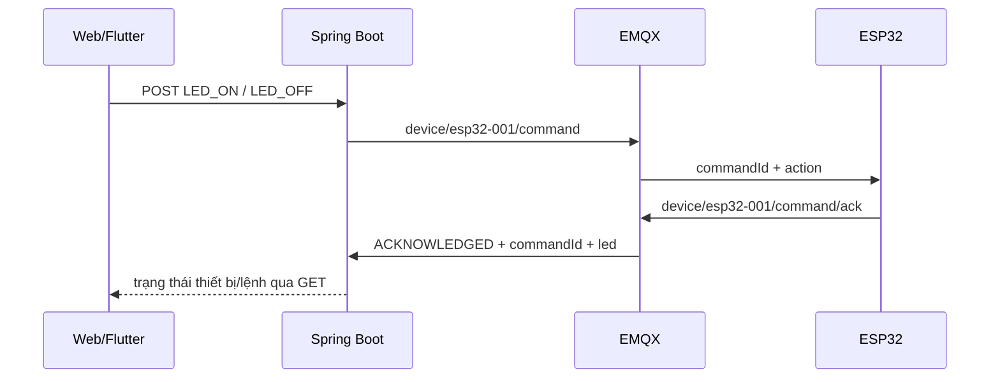
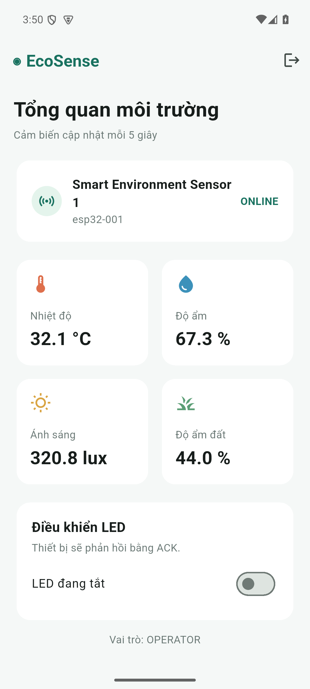

# Báo cáo triển khai — EcoSense

**Bản nháp:** Các mục cần ESP32/DHT22/LED thật và video minh chứng phải được cập nhật sau khi kiểm tra trên phần cứng.

## 1. Mục tiêu và kiến trúc

Hệ thống giám sát môi trường gồm ESP32/DHT22/LED hoặc simulator Python, EMQX, Spring Boot, PostgreSQL, web React và Flutter. Thiết bị gửi telemetry và status qua MQTT; backend lưu dữ liệu, cung cấp REST API có JWT cho web và mobile. Lệnh LED đi từ web/mobile qua REST API, backend publish MQTT command, thiết bị thực thi rồi gửi ACK giữ nguyên `commandId`.

## 2. Phần đã triển khai

- Firmware ESP32 đọc DHT22 bằng giao thức xung, kiểm tra checksum và giới hạn vật lý; đọc lỗi thì bỏ qua mẫu, không gửi số giả.
- Firmware đồng bộ SNTP, dùng ISO 8601 UTC, publish ONLINE và Last Will OFFLINE retained.
- Firmware phân tích command bằng cJSON, chỉ nhận `LED_ON`/`LED_OFF`, điều khiển GPIO2 và ACK đúng `commandId`.
- Web React được thiết kế lại theo tiếng Việt, responsive, có biểu đồ, lịch sử, trạng thái kết nối, lệnh gần nhất và xử lý lỗi tải dữ liệu.
- Flutter có Android project, dashboard và login mới, hỗ trợ cấu hình API LAN qua `--dart-define`.
- Chức năng nâng cao: cảnh báo nhiệt độ lớn hơn 35 °C trên web và mobile từ telemetry hiện có. Firmware, MQTT, backend và database đã cung cấp giá trị nhiệt độ; không cần đổi schema hay payload.

## 3. MQTT contract và phần cứng

Thiết bị dùng `deviceId=esp32-001`. Telemetry `device/esp32-001/telemetry` QoS 0; command và ACK QoS 1; status QoS 1 retained. Trường `illuminance` và `soilMoisture` gửi `null` khi chỉ lắp DHT22. Chi tiết và sơ đồ GPIO nằm trong README.

## 4. Kết quả kiểm tra phần mềm

| Kiểm tra | Kết quả |
|---|---|
| ESP-IDF 5.5.5 `idf.py build` cho target ESP32 | Đạt, sinh firmware `.bin` |
| React `npm run build` | Đạt |
| Flutter `flutter analyze` | Đạt |
| Flutter `flutter build apk --debug` | Đạt, sinh `app-debug.apk` |
| Docker Compose và Flyway | Đạt, cả 5 container Up; Flyway áp dụng 3 migration |
| Simulator → MQTT → backend → API | Đạt, telemetry lưu mỗi 5 giây |
| LED_ON, LED_OFF và ACK | Đạt trên simulator, command chuyển `ACKNOWLEDGED`, LED state đúng |
| Phân quyền viewer | Đạt, POST command trả HTTP 403 |
| Web và đường dẫn lịch sử | Đạt, HTTP 200 cho `/` và `/logs` |
| Dừng/khởi động lại simulator | Đạt, trạng thái lần lượt OFFLINE và ONLINE |
| Flutter trên Android Emulator | Đạt, đăng nhập operator và đọc cùng telemetry từ API |
| Điều khiển LED từ Flutter | Đạt trên simulator, LED state đổi ON rồi OFF trong backend |
| ESP32, DHT22, LED, rút nguồn và mobile trên máy thật | Chưa kiểm chứng: chưa có board/cổng COM được kết nối |

Ảnh dưới đây là app mobile nhận **dữ liệu simulator**, dùng để chứng minh phần mềm hoạt động. Khi nộp bài, cần bổ sung ảnh nhận dữ liệu từ ESP32 thật.

## 5. Kế hoạch xác nhận và minh chứng

Phần mềm bằng simulator đã kiểm tra xong. Bước tiếp theo cần phần cứng: dừng simulator, cấu hình Wi-Fi và IP broker, flash ESP32, kiểm tra dữ liệu thật trên web/mobile, điều khiển LED hai chiều và rút nguồn để xác nhận OFFLINE. Lưu ảnh màn hình web/mobile, log command ACK và video 5–7 phút theo thứ tự trong tài liệu hướng dẫn. Khi có kết quả phần cứng, cập nhật bảng ở mục 4, điền thông tin nhóm và xuất tài liệu này thành PDF để nộp.
